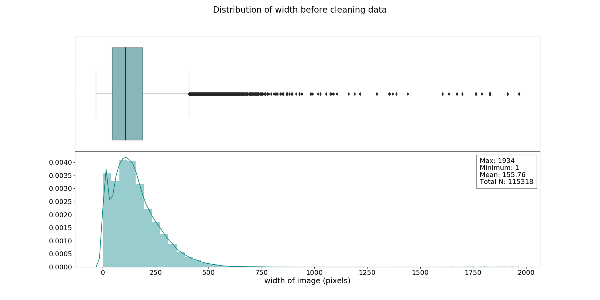
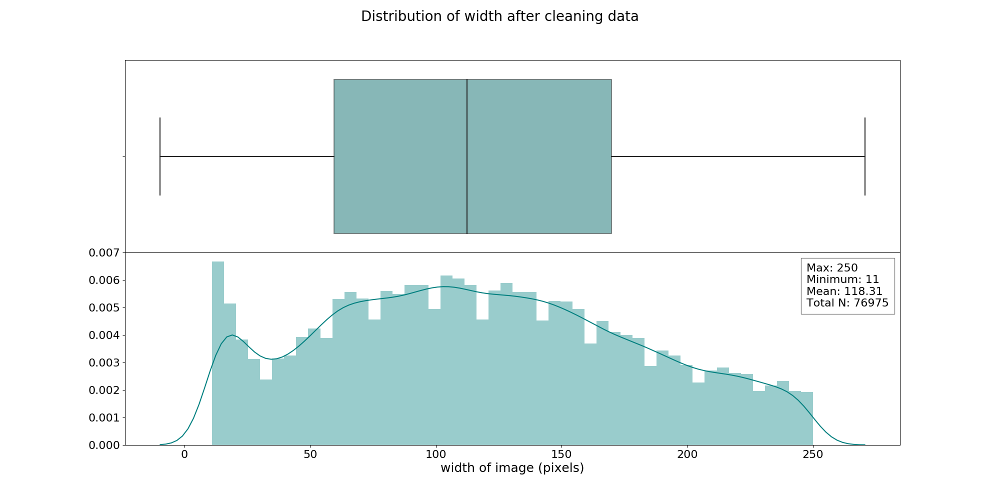
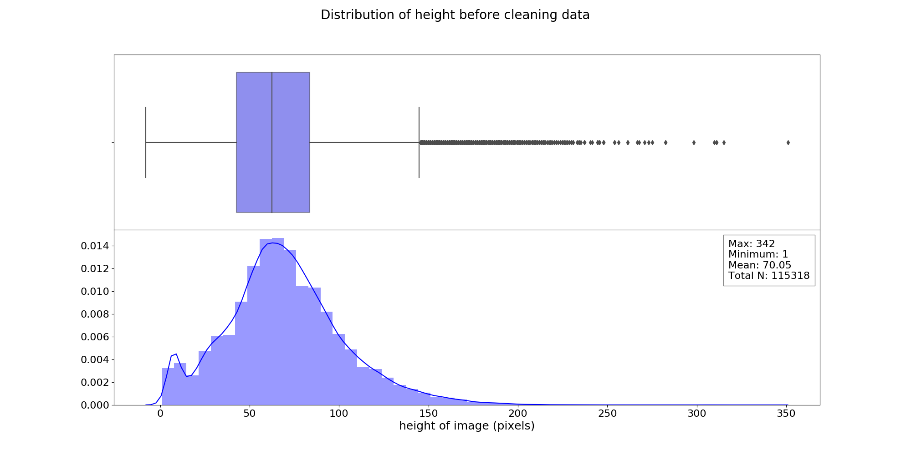
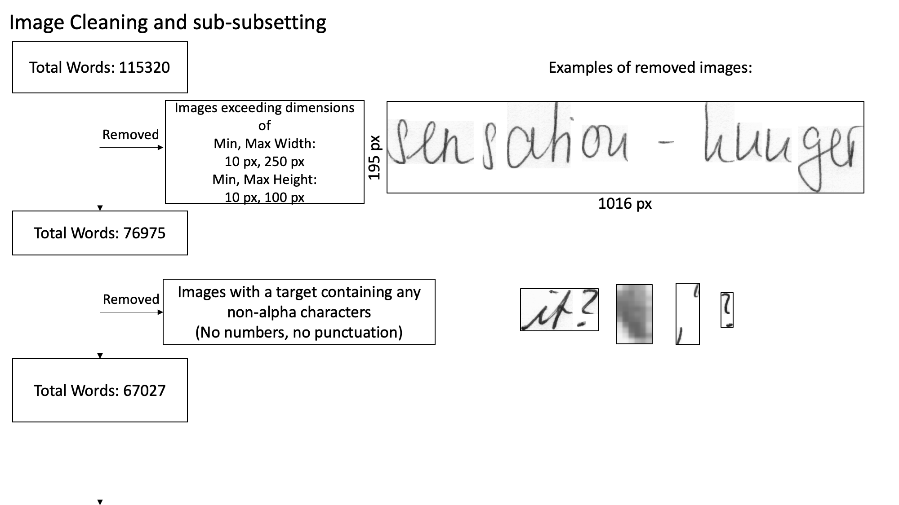
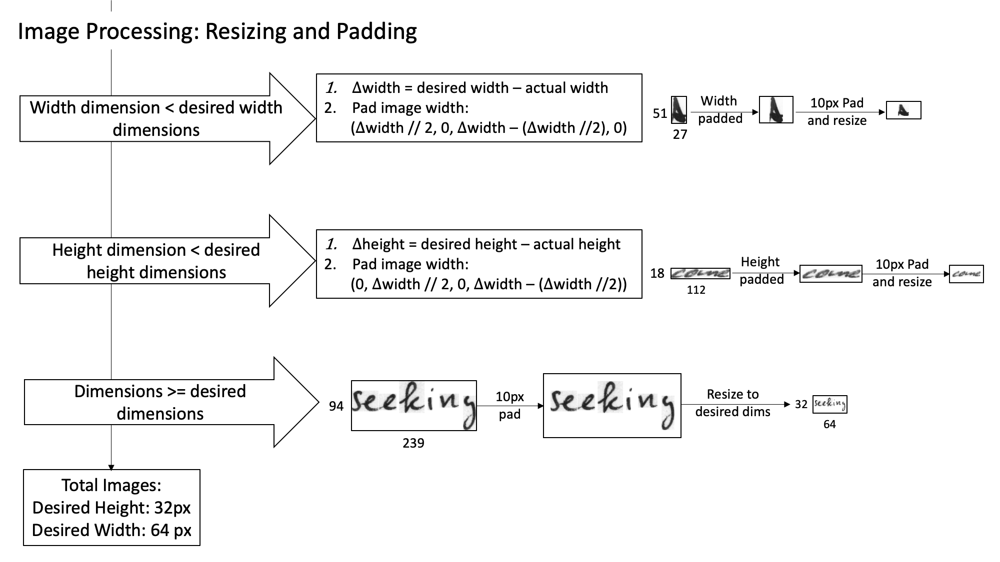
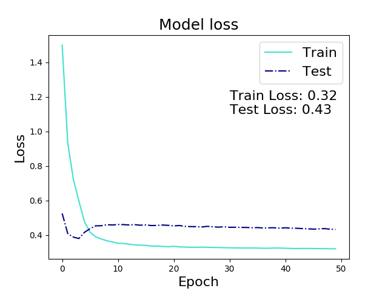
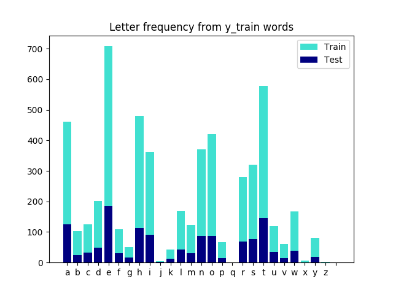
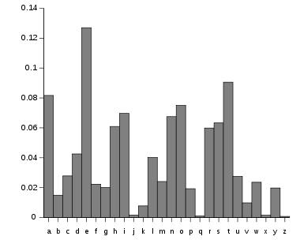
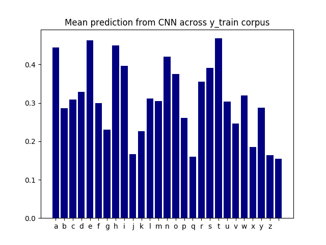

**********************************************
# Handwriting Image Recognition
**********************************************

#### Author: Rosie M Martinez, ScD, MPH
#### Website: https://github.com/rosiemin/Handwriting-Image-Recoginition
*Last update: 3/22/2019*

## Table of Contents
* [The Goal](#Goal)
* [Background](#Background)
* [Exploratory Data Analysis](#Exploratory-Data-Analysis)
  * [Data Cleaning](#Data-Cleaning)
  * [Data Pipeline](#Data-Pipeline)
* [CNN Modeling](#CNN-Modeling)
  * [The Model](#The-Model)
  * [Results](#Results)
  * [Letter Based Thresholds](#Attempting-to-do-letter-based-thresholds)
* [Final Thoughts](#Final-Thoughts)
* [Next Steps](#Next-Steps)

# Goal:
The goal of this capstone was to caption images of handwritten text using deep learning methods. This project will be broken down into the following steps:

##### Capstone 2:
- [ ] Create Pipeline for cleaning/resizing images
- [ ] Getting all targets, removing non-alpha characters
- [ ] Exploratory data analysis
- [ ] Use CNN model to identify presence of letter or not
- [ ] Use CNN model to identify length of word on portion of data
- [ ] Understanding output of model & identify thresholds of letters

##### Capstone 3:
- [ ] Scale up model examining all the words
- [ ] Use CNN-LSTM model to identify ordered letters from a word
- [ ] Scale model up, using words to line on portion of data
- [ ] Run CNN-LSTM model on full dataset for words to line
- [ ] Understanding output of model & identify thresholds or words
- [ ] Look at using Transfer Learning to train my models
- [ ] Attempt a working demo of the CNN-LSTM words to line model
 [Return to Top](#Table-of-Contents)

# Background:
The IAM Handwriting database was first published in 1999 and was developed for handwritten recognition. This database contains forms of unconstrained handwritten text. Each form can be divided into lines of text and each line of text can be divided into individual words. [dataset](http://www.fki.inf.unibe.ch/databases/iam-handwriting-database)

  

[Return to Top](#Table-of-Contents)

# Exploratory Data Analysis:
The IAM handwriting dataset contains 1,539 forms written be 657 unique individuals. In total, there are 13,353 lines and 115,320 separated words.

### Data Cleaning:
- Set a threshold of max width and max height an image could be for this model.

      

    

[Return to Top](#Table-of-Contents)

### Data Pipeline

[Return to Top](#Table-of-Contents)

# CNN Modeling:
### Examining the presence of a letter or not:
The target words were transformed into a 1d-vector that examined the presence of a letter in a word or not.

  

[Return to Top](#Table-of-Contents)

### The Model:
**This model was trained on 1600 images and was tested on 400 images**

HyperParameters:
1. Epochs: 50
2. Batch Size: 100
3. Gradient Descent Optimizer: Adam
4. Adam Learning Rate: 0.00001
5. Loss Function: Binary Cross-Entropy

  

Model Adapted from [@qjadud1994](https://github.com/qjadud1994/CRNN-Keras) and [@githubharald](https://github.com/githubharald/SimpleHTR_)

[Return to Top](#Table-of-Contents)

### Results:

##### With a 50% threshold (default for Keras):

  

**Why do we see that the test data constantly does better in terms of accuracy compared to the training data?**
The Keras model has two modes, training and testing, and many of the methods we use to avoid overfitting such as regularization or dropout in our training aren't applied when we run our testing data through. [source](https://keras.io/getting-started/faq/)

  

  

[Return to Top](#Table-of-Contents)

### Attempting to do letter based thresholds:
From the y_train dataset, I summed the total amount of letters across all 1600 words:

  
  

On the left is the frequency of letters from my y-training dataset and on the right is the letter frequencies that has been cited [here](https://en.wikipedia.org/wiki/Letter_frequency). The the two are very similar in trend, so this could allow me to use the more commonly used frequencies as weights to identify the thresholds of the individual letters for my letters. Conversely, I could just use my training corpus to identify thresholds that might be relevant for the testing data.
  
I decided to take the mean of each letter across all the words to use that as a threshold to examine my y_test data:  

  

So based on these thresholds, the actual y-test frequencies vs the y-test predicted frequencies are:

| letter | y_test_freq | threshold | y_pred | precision | recall | accuracy |
|--------|-------------|-----------|--------|-----------|--------|----------|
| a      | 125         | 0.451     | 63     | 0.381     | 0.192  | 0.65     |
| b      | 25          | 0.293     | 72     | 0.083     | 0.24   | 0.788    |
| c      | 32          | 0.317     | 94     | 0.064     | 0.188  | 0.715    |
| d      | 49          | 0.335     | 82     | 0.207     | 0.347  | 0.758    |
| e      | 185         | 0.47      | 58     | 0.586     | 0.184  | 0.562    |
| f      | 30          | 0.307     | 85     | 0.106     | 0.3    | 0.758    |
| g      | 16          | 0.238     | 74     | 0.081     | 0.375  | 0.805    |
| h      | 113         | 0.457     | 93     | 0.409     | 0.336  | 0.675    |
| i      | 91          | 0.403     | 96     | 0.26      | 0.275  | 0.658    |
| j      | 2           | 0.173     | 63     | 0         | 0      | 0.838    |
| k      | 13          | 0.233     | 67     | 0.075     | 0.385  | 0.825    |
| l      | 42          | 0.319     | 89     | 0.124     | 0.262  | 0.728    |
| m      | 30          | 0.312     | 85     | 0.094     | 0.267  | 0.752    |
| n      | 87          | 0.428     | 91     | 0.308     | 0.322  | 0.695    |
| o      | 86          | 0.383     | 81     | 0.247     | 0.233  | 0.682    |
| p      | 15          | 0.268     | 78     | 0.051     | 0.267  | 0.788    |
| q      | 1           | 0.167     | 59     | 0         | 0      | 0.85     |
| r      | 69          | 0.363     | 70     | 0.257     | 0.261  | 0.742    |
| s      | 77          | 0.398     | 91     | 0.165     | 0.195  | 0.655    |
| t      | 146         | 0.475     | 86     | 0.535     | 0.315  | 0.65     |
| u      | 34          | 0.31      | 87     | 0.069     | 0.176  | 0.728    |
| v      | 15          | 0.253     | 81     | 0.025     | 0.133  | 0.77     |
| w      | 38          | 0.326     | 58     | 0.069     | 0.105  | 0.78     |
| x      | 1           | 0.192     | 63     | 0.016     | 1      | 0.845    |
| y      | 18          | 0.294     | 106    | 0.085     | 0.5    | 0.735    |
| z      | 1           | 0.171     | 67     | 0         | 0      | 0.83     |

[Return to Top](#Table-of-Contents)

# Final Thoughts:
- There is a lot more to be done (see below). I think this is a good first step in terms of starting to understand neural nets a bit more with more hands-on practice, but it is far from useable.
  - For predicting presence of letter, class weights were not taken into account. I tried to deal with that post hoc, but that is not necessarily the ideal way to deal with data.
    - I weighted the amount of times a letter showed up in my corpus of my training data to influence how those thresholds would impact the testing data. Instead I could try to implement the frequencies of letters in English found [here](https://en.wikipedia.org/wiki/Letter_frequency).
  - I wanted to also predict the number of letters in an image, but I just couldn't get that code up and running in tandem with my is a letter present or not.
  - I can still mess around with several of the hyper-parameters. My neural net I developed was based on a combination of a few other CNNs I found examining handwritten images. These, however, were fed into a LSTM to predict the actual word [see goals](#Goal)
  - I also want to further examine why I am seeing such a high accuracy, this (I hypothesize) is partially due to the class imbalances, just a high presence of 0's across the board for most letters, especially the uncommon ones.
  - Something else to consider, I have not "unslanted" any of my words, many people in the literature found that these models had a hard time predicting cursive or slanted words, so next steps would be to add that step to my image processing pipeline so I can make sure I can get as "clean" of an image as possible. [link](https://github.com/githubharald/DeslantImg)

# Next Steps:
##### Capstone 2:
- [x] Create Pipeline for cleaning/resizing images
- [x] Getting all targets, removing non-alpha characters
- [x] Exploratory data analysis
- [x] Use CNN model to identify presence of letter or not
- [ ] Use CNN model to identify length of word on portion of data
- [x] Understanding output of model & identify thresholds of letters

##### Capstone 3:
- [ ] Scale up model examining all the words
- [ ] Use CNN-LSTM model to identify ordered letters from a word
- [ ] Scale model up, using words to line on portion of data
- [ ] Run CNN-LSTM model on full dataset for words to line
- [ ] Understanding output of model & identify thresholds or words
- [ ] Look at using Transfer Learning to train my models
- [ ] Attempt a working demo of the CNN-LSTM words to line model
 [Return to Top](#Table-of-Contents)
