# Handwriting Image Recognition using Keras
# Author: Rosie M Martinez, ScD, MPH

*This project was created for a final capstone for the Galvanize Data Science Immersive program in Denver, CO. This repo will not be monitored regularly*

*Last update: 4/18/2019*

## Table of Contents
* [The Goal](#Goal)
* [The Data](#The-Data)
* [Data Cleaning](#Data-Cleaning)
* [CNN-LSTM Modeling](#CNN-LSTM-Modeling)
  * [Training](#Training)
  * [Predicting](#Predicting)
* [Results](#Results)
* [Final Thoughts](#Final-Thoughts)
* [Next Steps](#Next-Steps)
* [References](#References)

# Goal:
The goal of this capstone was to caption images of handwritten text using a CNN-LSTM Seq-2-Seq method. This project was completed over two months where the first month was working on getting a model up and running and understanding the data. For more information on that, click [here](https://github.com/rosiemin/Handwriting-Image-Recoginition/blob/master/Capstone_2.md)

# The Data:
The IAM Handwriting database was first published in 1999 and was developed for handwritten recognition. This database contains forms of unconstrained handwritten text. Each form can be divided into lines of text and each line of text can be divided into individual words. [dataset](http://www.fki.inf.unibe.ch/databases/iam-handwriting-database)

  

**In order to access this data, you will need to create a user login name and download the words data and `words.txt` file from [here.](http://www.fki.inf.unibe.ch/databases/iam-handwriting-database) Put the entire words folder and the `words.txt` file into a folder labeled `data`**

Your file structure should look similar to this:

      ├── checkpoints
      ├── data
      │   ├── labels.json
      │   ├── words.txt
      │   ├── words
      │   │   ├── a01
      │   │   │   ├── a01-000u
      │   │   │   │   ├── a01-000u-00-00.png
      │   │   │   │   └── ...   
      │   │   │   └── ...     
      │   │   ├── a02
      │   │   └── ...
      ├── models
      ├── cnn_lstm.py
      ├── README.md
      ├── src
      │   ├── config.yml
      │   ├── data_gen.py
      │   ├── labels_ttsplit.py
      │   ├── model.py
      │   ├── predictor.py
      │   ├── preprocess.py
      │   ├── train.py
      │   └── trainer.py

The IAM handwriting dataset contains **1,539** forms written be **657** unique individuals. In total, there are **13,353** lines and **115,320** separated words.

# Data Cleaning:
For the purposes of this capstone, the data were cleaned based on a few features.

1. Images were first examined and any image with a width of 900px or greater were excluded. (202 words)
  - *This was because many of these extra wide images were errors and actually images of entire sentences rather than a single image*
2. Images listed in the `words.txt` file as an 'err'. (18662 words)
  - *This was a personal preference. I choose to run a sensitivity analysis examining the results between the filter from cleaning step 1 and this cleaning step. I found that my word error rate and character error rate were both reduced by 2% and my model ran faster (an hour less).*

  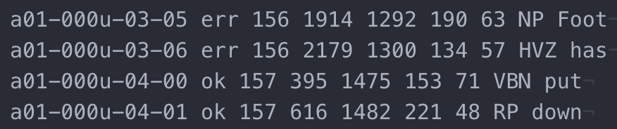

After the data were clean, I ended up with:
* 96,456 words
  * 78,129 in my training set
  * 8,691 in my validation set
  * 9,646 in my testing set

If you want to run using these same splits of files, make sure that in your `config.yaml` file, the 'labels_file' uses the `data/labels.json` path. If you want to create your own split, run the `labels_ttsplit.py` file (making sure the `words.txt` file is in the data folder

# CNN-LSTM Modeling:
This model uses a convolutional neural network that feeds into a sequential LSTM network using the Seq-2-Seq framework found [here](https://google.github.io/seq2seq/).

  

## Training:
In order to predict using this framework, you will need to train the model first. There are one of two ways you can do this.

1. iPython or Python method:
  * From the command line:
          python src/train.py
  * From ipython
          run src/train.py
2. Command Line Interface:
          python cnn_lstm.py -c src/config.yml --train

## Predicting:
Once the model has been trained and weights have been saved in the `models` folder, you can predict on your testing dataset.

1. iPython or Python method:
  * From the command line:
          python src/predict.py
  * From ipython
          run src/predict.py
2. Command Line Interface:
          python cnn_lstm.py -c src/config.yml --predict

# Results:
My results based on the model I trained were:

**Character Error Rate (CER) = 10.3%** 
**Word Error Rate (WER) = 24.4%**

Examples of output from prediction:

  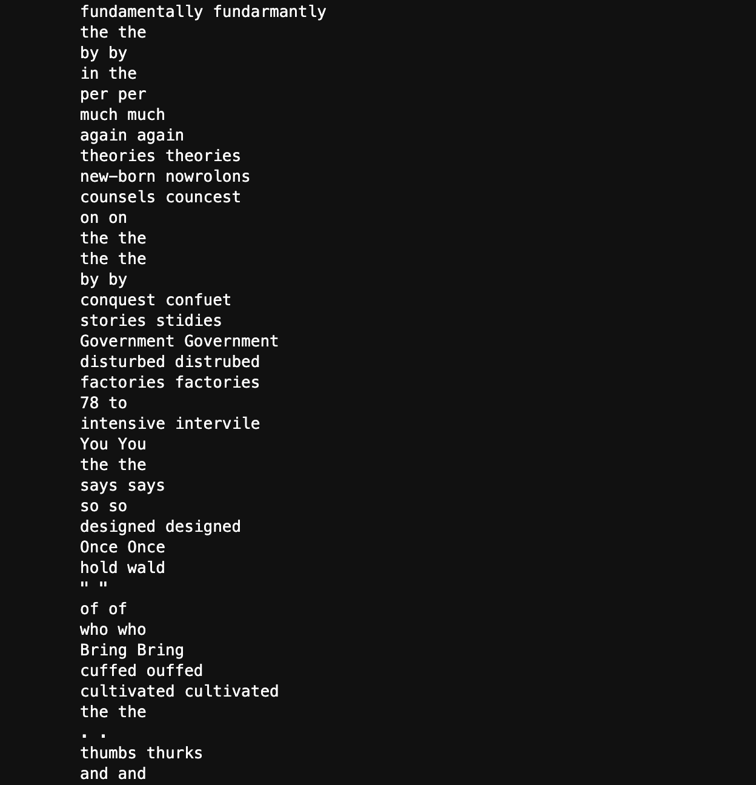

  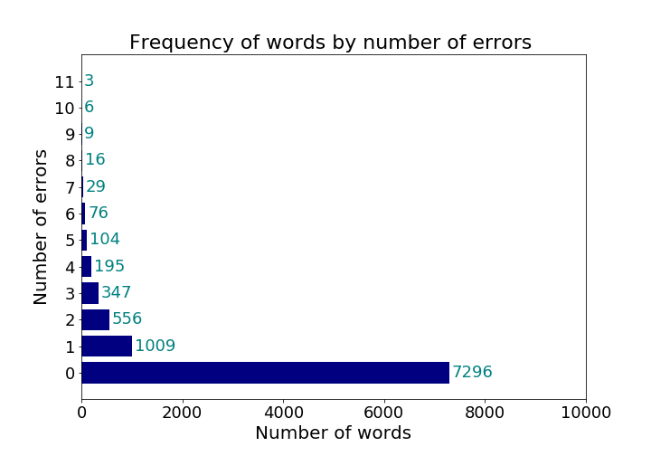

  

Examples of words with their true labels and actual labels:

  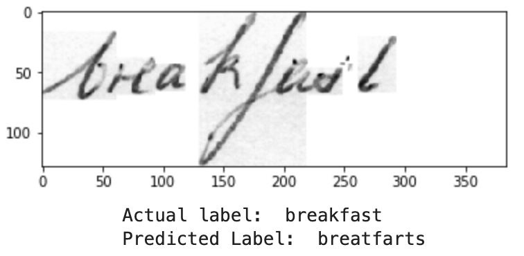
  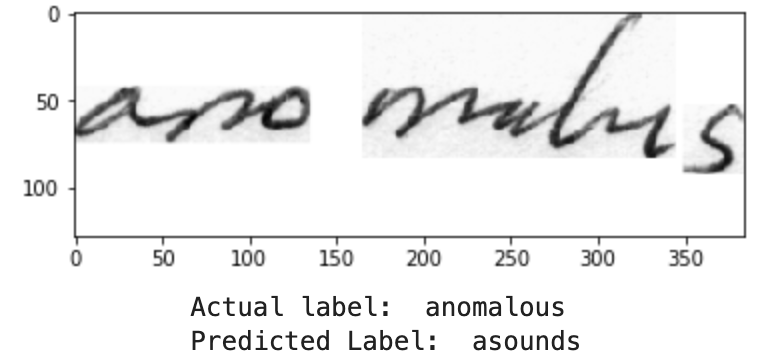
  
  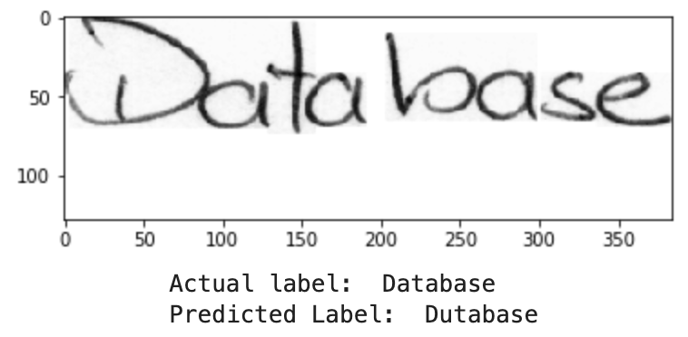
  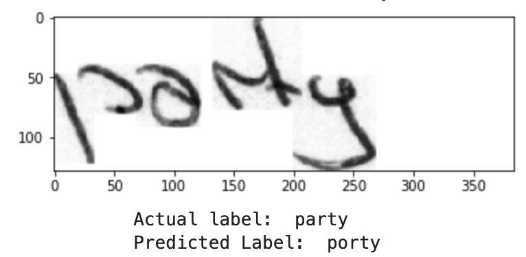
  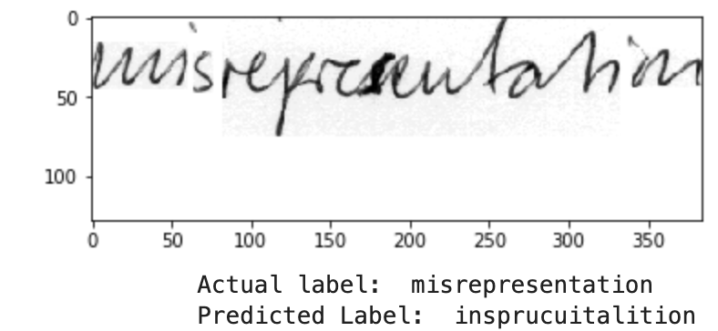
  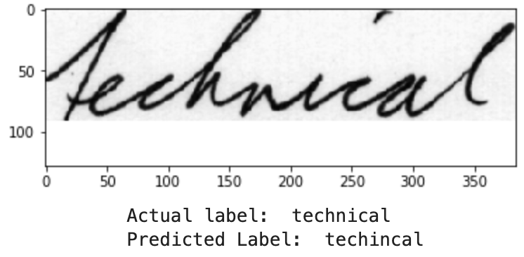
  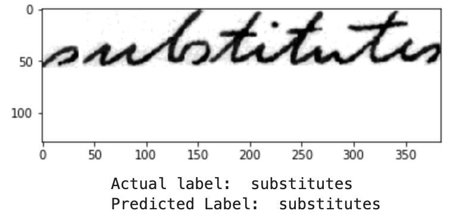
  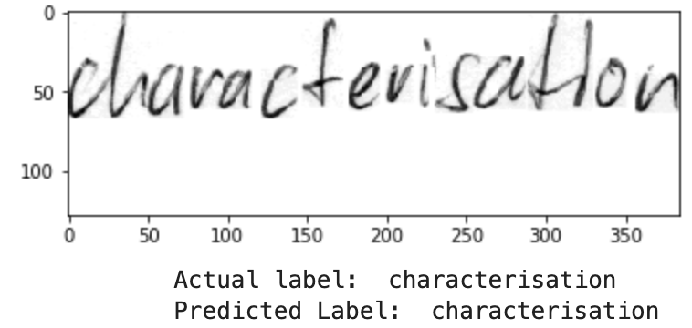
  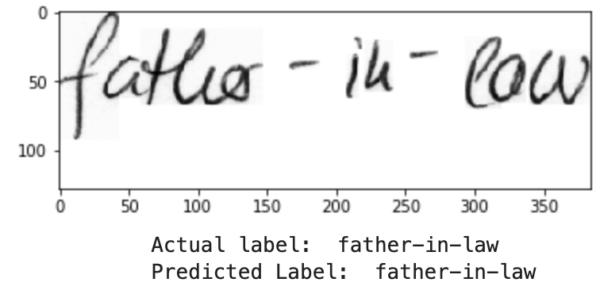
  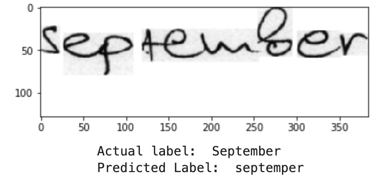
  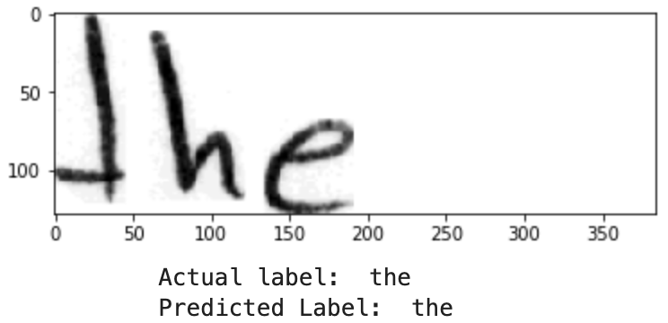
  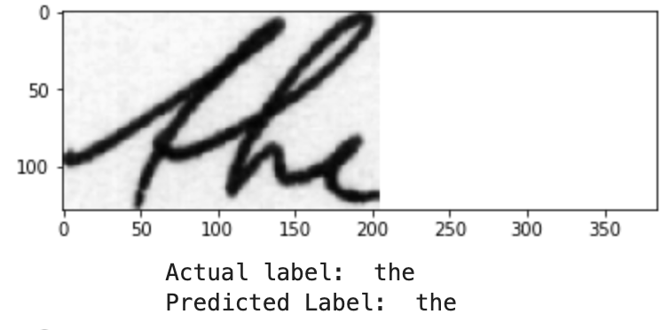
  

# Final Thoughts:
While this model is far from perfect, there was a lot of progress between the capstone 2 project and this final capstone.

This particular portion of was focused on generating 'captions' for images of handwritten words. I modified previous work done by [giovanniguidi](https://github.com/giovanniguidi/Seq-2-Seq-OCR) after cleaning the data. This data was trained on a CNN-LSTM based model, using Seq2Seq based logic to predict next characters.

While I tried to account for many of the mislabeled words, there were too many to go through by hand, however, regardless, this model worked well for and still provided a low error rate of characters.

One other topic that I didn't consider for this current project was working with data augmentation, dealing with slanted or cursive words. Many people in the literature found that these models had a hard time predicting cursive or slanted words, so next steps would be to add that step to my image processing pipeline so I can make sure I can get as "clean" of an image as possible. [link](https://github.com/githubharald/DeslantImg)

## Next Steps:

- Improve metrics, reducing CER and/or WER for character based model
- Scale model up, using words to line on portion of data
- Run CNN-LSTM model on full dataset for words to line
- Attempt a working demo of the CNN-LSTM words to line model
- Examine other methods of handwriting recognition (CTC loss)

### References:

1. [giovanniguidi's GitHub](https://github.com/giovanniguidi/Seq-2-Seq-OCR)
2. [Google's Seq2Seq](https://google.github.io/seq2seq/)
3. [Tensorhub Github Neural Machine Translation Tutorial](https://github.com/tensorflow/nmt)
4. [Manish Chabliani's article on Seq2Seq](https://towardsdatascience.com/sequence-to-sequence-model-introduction-and-concepts-44d9b41cd42d)
5. [Cole Murray's article on Building an image caption generator](https://medium.freecodecamp.org/building-an-image-caption-generator-with-deep-learning-in-tensorflow-a142722e9b1f)
6. [Sequence to Sequence Learning with Neural Networks paper by Sutskever, H, Vinyals O, and Le QV](https://arxiv.org/pdf/1409.3215.pdf)
